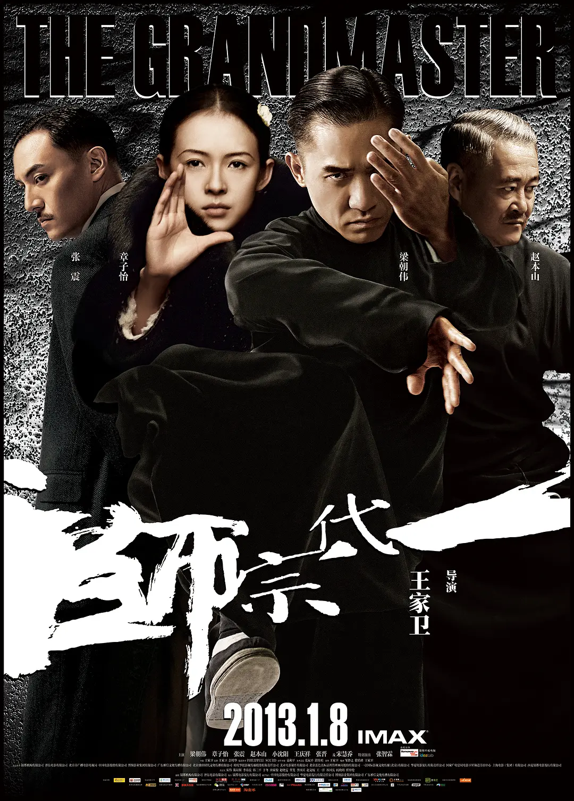

# 一代宗师

《一代宗师》是香港导演王家卫执导的功夫电影，由梁朝伟、章子怡、张震、宋慧乔、王庆祥、张晋、赵本山、小沈阳等人主演。

该片讲述了民国期间“南北武林”多个门派宗师级人物，以及一代武学宗师叶问的传奇一生。

该片于2013年1月8日在中国内地上映，2月7日作为第63届柏林国际电影节开幕电影。该片先后获得亚洲电影大奖最佳影片、香港电影金像奖最佳影片、中国金鸡百花电影节最佳影片等奖项。

2015年1月8日，《一代宗师》3D版于中国内地上映，票房超过6000万，创造了国产影片重映最高票房纪录。

::: info 台词
一约既定，万山难阻。

叶底藏花一度，梦里踏雪几回。

郎心自有一双脚，隔江隔海会归来。

我踏出这一步的时候，我以为有一天我还会回来，想不到那次是最后一面，从此我只有眼前路，没有身后身，回头无岸。

叶先生，世间所有的相遇，都是久别重逢。
:::